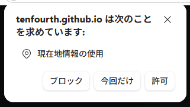

# gpsspeed
PWAで実装したスピードメーター。スマートフォンやタブレットのGPSと加速度センサー(IMU)で移動体の様子を可視化します

## URL

こちらのURLにブラウザからアクセスして利用します。

* https://tenfourth.github.io/gpsspeed/

# 初期設定

初回のアクセスで位置情報の許可を求められます。本アプリではスマートフォンやタブレットのGPSを使って速度を求めるため、位置情報が必要になります。位置情報はユーザーの端末内のみの利用までで、サーバーへの送信や外部サービス等には共有されません

ブロックすると速度は取得できません